<div align="center">

<!-- SentinelX Logo -->


# `SentinelX`

**Enterprise Linux Runtime Integrity & Rootkit Detection Platform**

<!-- Typing SVG -->
<a href="https://git.io/typing-svg">
  
</a>

<br />

<!-- Badges Row 1: Core -->
<a href="LICENSE"></a>
<a href="VERSION"></a>
<a href="https://www.rust-lang.org/"></a>
<a href="https://github.com/0xhroot/sentinelx/actions/workflows/ci.yml"></a>
<a href="SECURITY.md"></a>
<a href="#testing"></a>

<br />

<!-- Badges Row 2: Platform & Community -->
<a href="https://www.kernel.org/"></a>
<a href="#docker"></a>
<a href="https://github.com/0xhroot/sentinelx/stargazers"></a>
<a href="https://github.com/0xhroot/sentinelx/network/members"></a>
<a href="https://github.com/0xhroot/sentinelx/issues"></a>
<a href="https://github.com/0xhroot/sentinelx/discussions"></a>
<a href="https://github.com/0xhroot/sentinelx/pulse"></a>

<br />
<br />

<!-- Quick Action Buttons -->

<a href="#-quick-start">
  
</a>
<a href="#-architecture-overview">
  
</a>
<a href="#rest-api">
  
</a>
<a href="https://github.com/0xhroot/sentinelx/blob/main/docs/INSTALL.md">
  
</a>

<br />


</div>

---

<div align="center">

<!-- Gradient Separator -->


<!-- Fallback gradient if SVG not yet available -->


</div>

<br />

## 🔍 What Is SentinelX?

> [!IMPORTANT]
> SentinelX is an **open-source, evidence-driven** Linux runtime integrity monitoring and rootkit detection platform written entirely in **Rust**. It provides real-time kernel-level telemetry, multi-engine threat detection, automated incident response, and fleet-wide coordination for enterprise security operations.

```
   ┌─────────────────────────────────────────────────────┐
   │              SentinelX Pipeline                      │
   │                                                      │
   │   Kernel ─▶ Telemetry ─▶ Discovery ─▶ Assessment    │
   │                                    ─▶ Evidence       │
   │                                    ─▶ Correlation    │
   │                                    ─▶ Response       │
   │                                                      │
   │   🔒 Immutable    ⚡ Real-time    🛡️ Automated      │
   └─────────────────────────────────────────────────────┘
```

**Why was it built?**

| Problem | Existing Tools | SentinelX |
|---------|---------------|-----------|
| **Kernel visibility** | eBPF-only tools lack filesystem/audit context | Unified: eBPF + fanotify + netlink + audit |
| **Detection accuracy** | Signature-based tools produce high false positives | Evidence-driven pipeline with 5-dimension scoring |
| **Response capability** | Detection-only tools require manual intervention | Automated response with safety controls & rollback |
| **Fleet management** | Single-host tools lack multi-host coordination | Built-in fleet management with TLS transport |
| **Memory safety** | C/C++ tools are vulnerable to exploitation | Written in Rust with minimal unsafe (52 audited FFI blocks) |
| **Architecture** | Monolithic tools resist extension | 34-crate modular workspace |

**Design Philosophy:**

1. **Evidence is immutable.** `CoreEvidence` objects cannot be modified once created — ensuring forensic integrity.
2. **Graceful degradation.** Every subsystem has fallback paths. eBPF unavailable? fanotify takes over.
3. **Safety by default.** Dry-run mode. Never kills PID 1. Never unloads core modules. Never quarantines system binaries.
4. **Pipeline-driven.** All data flows through 4 layers: Discovery → Metadata → Assessment → Evidence.
5. **Offline-first.** Threat intelligence, MITRE ATT&CK mappings, and detection rules work without network connectivity.

<br />

---

## 🦀 Why SentinelX?

<div align="center">

| | | |
|:---:|:---:|:---:|
| **🛡️ Evidence Driven** | **⚡ Real-time Telemetry** | **🦀 Memory Safe** |
| Immutable evidence ensures forensic integrity | Kernel-level events via eBPF, fanotify, netlink, audit | Written in Rust — no buffer overflows, no use-after-free |
| **🔬 Behavior Analysis** | **🚀 Fleet Management** | **📊 Dashboard** |
| 7-factor weighted behavioral profiling | Multi-host coordination with TLS/mTLS | React + TypeScript SPA with 10 monitoring pages |
| **🔍 7 Detection Engines** | **🤖 Automated Response** | **🧠 Threat Intelligence** |
| Process, module, network, kernel, memory, file, persistence | 22 response actions with safety controls & rollback | IoCs, MITRE ATT&CK, YARA, Sigma, CVE tracking |

</div>

<br />

---

## 📊 Project At A Glance

<div align="center">

| | | | |
|:---:|:---:|:---:|:---:|
| **40** | **696** | **86** | **34** |
| Rust Crates | Tests Passing | REST API Endpoints | CLI Commands |
| **10** | **1.0.0** | **22** | **6** |
| Architecture Phases | Stable Release | Response Actions | Fuzz Targets |

</div>

<br />

> [!TIP]
> **New to SentinelX?** Jump straight to the [Quick Start](#-quick-start) or explore the [Architecture Overview](#-architecture-overview).

---

## 🖥️ Demo

<table>
  <tr>
    <td align="center"><b>Dashboard Overview</b></td>
    <td align="center"><b>CLI Scan Output</b></td>
  </tr>
  <tr>
    <td align="center">
      
      <br />
      <sub>System health, key metrics, recent alerts</sub>
    </td>
    <td align="center">
      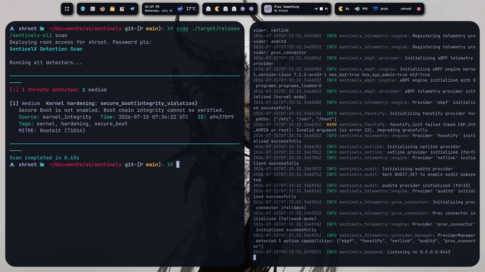
      <br />
      <sub>Terminal-based detection results</sub>
    </td>
  </tr>
  <tr>
    <td align="center"><b>Threats View</b></td>
    <td align="center"><b>Architecture Diagram</b></td>
  </tr>
  <tr>
    <td align="center">
      
      <br />
      <sub>Active threats with severity & MITRE mapping</sub>
    </td>
    <td align="center">
      
      <br />
      <sub>Full system architecture</sub>
    </td>
  </tr>
  <tr>
    <td align="center"><b>Fleet Management</b></td>
    <td align="center"><b>Telemetry Feed</b></td>
  </tr>
  <tr>
    <td align="center">
      
      <br />
      <sub>Multi-host agent status & health</sub>
    </td>
    <td align="center">
      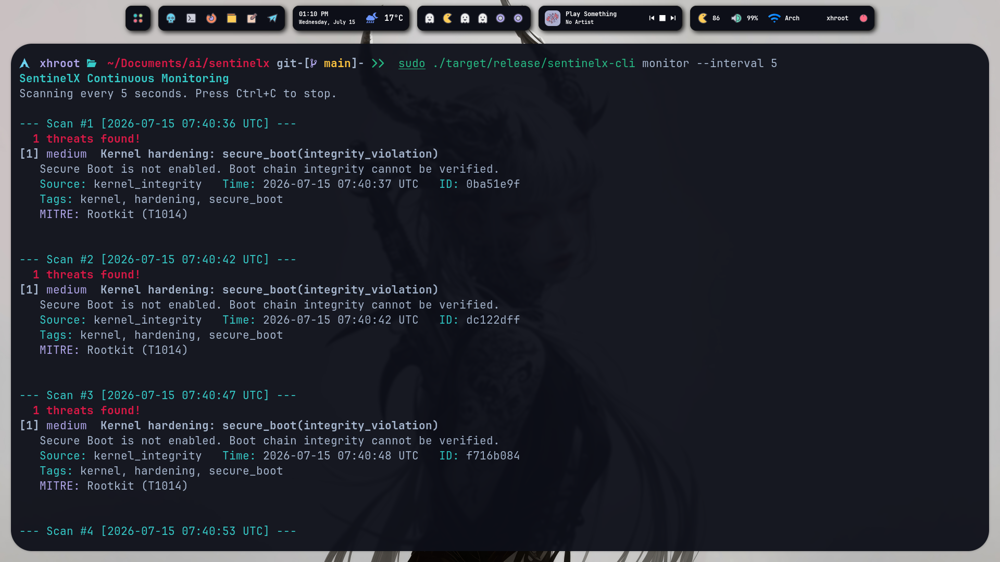
      <br />
      <sub>Real-time kernel events</sub>
    </td>
  </tr>
</table>

<!-- Video placeholder
<div align="center">
  <a href="https://www.youtube.com/watch?v=YOUR_VIDEO_ID">
    
  </a>
</div>
-->

<br />

---

## ⚡ Quick Start

### Three commands to start detecting threats:

```bash
git clone https://github.com/0xhroot/sentinelx && cd sentinelx
cargo build --release
sudo ./target/release/sentinelx-backend --host 0.0.0.0 --port 8443
```

Then in another terminal:

```bash
# Run a full system scan
sudo ./target/release/sentinelx-cli scan

# Check system status
sudo ./target/release/sentinelx-cli status

# View detected threats
sudo ./target/release/sentinelx-cli threats

# Enable continuous monitoring
sudo ./target/release/sentinelx-cli monitor --interval 30

# Open the dashboard at http://localhost:8443
```

> [!NOTE]
> SentinelX requires **root privileges** for kernel-level monitoring (eBPF, fanotify, netlink, audit). Some features can run without root, but full detection capability requires root.

---

## 🏗️ Architecture Overview

SentinelX processes security data through a pipeline of specialized subsystems. Each subsystem is implemented as one or more Rust crates in the workspace.

<details>
<summary><b>📐 System Architecture — Click to expand</b></summary>

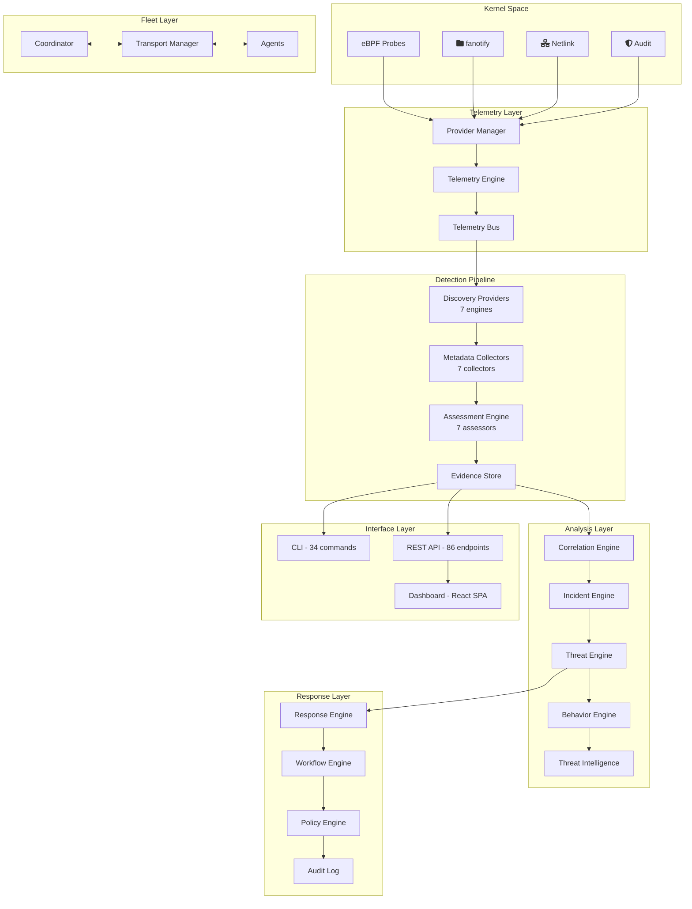

</details>

<details>
<summary><b>📦 Subsystem Responsibilities — Click to expand</b></summary>

| Subsystem | Crate(s) | Responsibility |
|-----------|----------|---------------|
| **Discovery** | `process`, `module`, `network`, `kernel`, `memory`, `integrity`, `persistence` | Discover security-relevant objects (processes, modules, connections, files) |
| **Metadata** | Same as Discovery | Enrich discovered objects with additional context (hashes, permissions, parents) |
| **Assessment** | `assessment` | Score objects across 5 dimensions: Trust, Integrity, Risk, Reputation, Confidence |
| **Evidence** | `evidence`, `core` | Create immutable `CoreEvidence` objects with full provenance |
| **Correlation** | `correlation` | Identify multi-indicator attacks via relationship graph and TOML rules |
| **Incident** | `incident` | Track security incidents through their lifecycle |
| **Threat** | `threat` | Generate threat decisions with weighted risk scores |
| **Response** | `response`, `rule_engine` | Execute automated response actions with safety controls |
| **Telemetry** | `telemetry` | Real-time event processing via kernel providers |
| **Behavior** | `behavior` | Profile object behavior across 7 weighted factors |
| **Intelligence** | `intelligence` | IoCs, MITRE ATT&CK, YARA, Sigma, CVE tracking |
| **Fleet** | `fleet`, `coordinator`, `agent`, `transport` | Multi-host coordination, heartbeat, policy distribution |
| **Database** | `database` | SQLite persistence for all data |
| **Configuration** | `config` | TOML-based configuration management |

</details>

<br />

---

### 🔄 Complete Processing Pipeline

Every piece of security data flows through SentinelX via this pipeline:

<details>
<summary><b>📈 Pipeline Flow — Click to expand</b></summary>

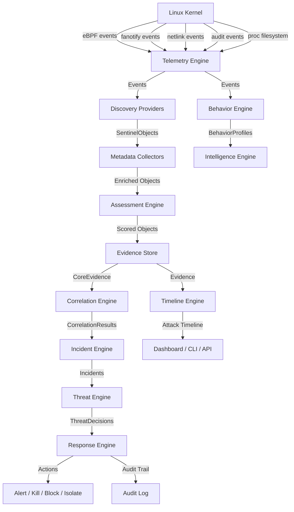

</details>

<details>
<summary><b>📋 Pipeline Stages — Click to expand</b></summary>

**Stage 1: Kernel Data Collection**

| Provider | Source | Events Captured |
|----------|--------|----------------|
| eBPF | Kernel probes via Aya | Process exec/exit/fork/clone/setuid, file open/write/delete, syscall tracing |
| fanotify | Filesystem notifications | File access, creation, deletion, permission changes |
| Netlink | AF_NETLINK socket | Interface changes, route updates, neighbor discovery |
| Audit | NETLINK_AUDIT socket | Syscall auditing, security events, access control |

**Stage 2: Discovery**

| Provider | Objects Discovered |
|----------|-------------------|
| `ProcessDiscoveryProvider` | Running processes, process trees, capabilities, open files |
| `ModuleDiscoveryProvider` | Loaded kernel modules, module signatures, module sources |
| `NetworkDiscoveryProvider` | Active connections, listening sockets, network interfaces |
| `KernelIntegrityProvider` | Kernel text integrity, syscall table, IDT/GDT |
| `MemoryIntegrityProvider` | Memory regions, injected code, process memory |
| `FileIntegrityProvider` | Critical file hashes, permission changes, new executables |
| `PersistenceDiscoveryProvider` | Systemd units, cron jobs, rc.local, LD_PRELOAD |

**Stage 3: Metadata Enrichment**

- **Process**: parent PID, command line, open files, capabilities, execution history
- **Module**: signature status, source (in-tree/out-of-tree), load address
- **Network**: connection state, remote endpoint, protocol, socket options
- **File**: SHA-256 hash, permissions, owner, modification time, SELinux context

**Stage 4: Assessment — 5 Dimensions**

| Dimension | Range | Description |
|-----------|-------|-------------|
| Trust | 0-100 | Based on signature verification, known-good status |
| Integrity | 0-100 | Based on hash comparison, tamper detection |
| Risk | 0-100 | Based on behavioral anomalies, suspicious patterns |
| Reputation | 0-100 | Based on threat intelligence, IoC matches |
| Confidence | 0.0-1.0 | Statistical confidence in the assessment |

**Stage 5: Evidence Generation**

Objects with non-None risk levels produce immutable `CoreEvidence` objects containing: unique evidence ID, object reference, all five assessment scores, collection timestamp, source detector name, and raw metadata.

**Stage 6: Correlation**

The correlation engine identifies multi-indicator attacks using: in-memory graph for relationship modeling, TOML-driven rules with 6 default patterns, time-window analysis (300s and 600s windows), and evidence clustering across detectors.

**Stage 7: Incident Creation**

Correlated evidence produces incidents with lifecycle status tracking (Open → Investigating → Contained → Resolved → Closed), attack chain reconstruction, MITRE ATT&CK mapping, and severity escalation (only upward).

**Stage 8: Threat Decision**

```
Final Score = Trust(20%) + Integrity(20%) + Risk(25%) + Reputation(15%) + Evidence(10%) + Complexity(10%)
```

**Stage 9: Response Execution**

The response engine selects and executes actions based on severity thresholds (critical, high, medium, low), confidence levels, threat type matching, and safety controls (dry-run, PID protection, module protection).

</details>

<br />

---

### 🗂️ Project Architecture

<details>
<summary><b>📁 Workspace Structure — Click to expand</b></summary>

```
sentinelx/
├── crates/                 # 34 Rust library crates
│   ├── common/             # Shared types and traits
│   ├── config/             # Configuration management
│   ├── core/               # Pipeline coordinator
│   ├── database/           # SQLite storage
│   ├── telemetry/          # Telemetry engine
│   ├── assessment/         # Assessment engine
│   ├── detector/           # Detection engine
│   ├── evidence/           # Evidence store
│   ├── rule_engine/        # Custom rules
│   ├── process/            # Process scanning
│   ├── module/             # Module scanning
│   ├── network/            # Network scanning
│   ├── kernel/             # Kernel integrity
│   ├── memory/             # Memory integrity
│   ├── integrity/          # File integrity
│   ├── persistence/        # Persistence scanning
│   ├── forensics/          # Forensic snapshots
│   ├── ebpf/               # eBPF sensor
│   ├── fanotify/           # fanotify monitoring
│   ├── netlink/            # Netlink monitoring
│   ├── audit/              # Audit subsystem
│   ├── correlation/        # Correlation engine
│   ├── incident/           # Incident management
│   ├── threat/             # Threat decisions
│   ├── timeline/           # Attack timeline
│   ├── behavior/           # Behavior profiling
│   ├── intelligence/       # Threat intelligence
│   ├── response/           # Response engine
│   ├── transport/          # TLS transport
│   ├── agent/              # Fleet agent
│   ├── coordinator/        # Fleet coordinator
│   ├── fleet/              # Fleet management
│   ├── benchmarks/         # Criterion benchmarks
│   └── integration-tests/  # Reliability tests
│
├── apps/
│   ├── cli/                # Command-line interface
│   └── dashboard/          # React web dashboard
│
├── backend/                # Axum REST API server
├── docs/                   # Architecture and operations docs
│   └── diagrams/           # Mermaid diagrams (10 files)
├── examples/               # Configuration, API, CLI examples
├── fuzz/                   # Fuzz testing (6 targets)
├── packaging/              # PKGBUILD, systemd, install scripts
├── book/                   # mdBook documentation site
└── .github/
    ├── workflows/          # CI/CD (3 workflows)
    ├── ISSUE_TEMPLATE/     # Issue templates
    └── dependabot.yml      # Dependency updates
```

</details>

<details>
<summary><b>🔗 Crate Dependency Graph — Click to expand</b></summary>

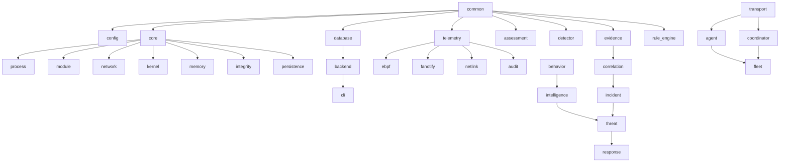

</details>

<br />

---

## 🧠 Core Concepts

<details>
<summary><b>🧩 Objects, Evidence, Assessments, Incidents, Threats, Responses — Click to expand</b></summary>

### Objects

A `SentinelObject` represents any security-relevant entity on the system:

| Object Type | Example | Canonical ID |
|-------------|---------|-------------|
| Process | sshd PID 1234 | `process:1234` |
| Kernel Module | nvidia | `module:nvidia` |
| Network Connection | TCP 10.0.0.1:22 | `network:10.0.0.1:22` |
| File | /etc/passwd | `file:/etc/passwd` |
| Kernel Symbol | sys_call_table | `kernel:sys_call_table` |

### Evidence

`CoreEvidence` is an immutable record of an assessment:

- **Immutable**: Created once, never modified
- **Attributed**: Linked to the source object and detector
- **Scored**: Contains all five assessment dimensions
- **Timestamped**: Records exact collection time
- **Auditable**: Full provenance chain

### Assessments

| Dimension | Assessor | Weight |
|-----------|----------|--------|
| Trust | Signature verification, known-good database | 20% |
| Integrity | Hash comparison, tamper detection | 20% |
| Risk | Behavioral anomaly detection | 25% |
| Reputation | Threat intelligence, IoC matching | 15% |
| Confidence | Statistical confidence in all scores | 10% (0-1.0) |

### Incidents

| Field | Description |
|-------|-------------|
| Status | Open, Investigating, Contained, Resolved, Closed |
| Severity | Info, Low, Medium, High, Critical |
| Attack Chain | Ordered steps of the attack |
| MITRE Mappings | ATT&CK technique IDs |
| Related Objects | Processes, files, modules involved |

### Threats

A `ThreatDecision` is the final output of the analysis pipeline:

- **Risk Score**: Composite score (0-100) from weighted dimensions
- **Priority**: Immediate, High, Normal, Low, Informational
- **Recommendation**: Suggested response actions
- **Response Plan**: Pre-defined response workflow

### Responses

| Safety Control | Default | Description |
|---------------|---------|-------------|
| `dry_run` | `true` | Log actions without executing |
| `never_kill_init` | `true` | Never kill PID 1 |
| `never_unload_core_modules` | `true` | Protect vmlinux, core, nvidia, drm, kvm |
| `never_quarantine_system_binaries` | `true` | Protect /usr/bin, /bin, /sbin |
| `never_delete_files` | `true` | Never delete files, only quarantine |

</details>

<br />

---

## 🔬 Detection Methodology

<details>
<summary><b>📋 Evidence Immutability & Correlation — Click to expand</b></summary>

### Why Evidence Is Immutable

Evidence immutability ensures forensic integrity. Once a `CoreEvidence` object is created during the assessment phase, it cannot be modified by any subsequent engine. This means:

- Correlation results cannot alter the underlying evidence
- Incident creation cannot modify evidence scores
- Threat decisions cannot change evidence timestamps
- Response actions cannot delete evidence records

### Why Correlation Exists

Single-indicator detections produce high false-positive rates. The correlation engine addresses this by:

1. **Multi-indicator detection**: Requiring multiple related events within a time window
2. **Relationship modeling**: Building a graph of entities and their relationships
3. **Pattern matching**: Applying TOML-driven rules to identify known attack patterns
4. **Temporal analysis**: Using time windows (300s, 600s) to group related events

### Default Correlation Rules

| Rule | Conditions | Window | Description |
|------|-----------|--------|-------------|
| Multi-indicator | 3+ events | 300s | Multiple security events from same source |
| Privilege escalation chain | 2+ events | 600s | Sequential privilege escalation indicators |
| Rootkit indicators | 3+ events | 300s | Hook + hidden process + integrity violation |
| Process anomaly cluster | 3+ events | 600s | Multiple process-related anomalies |
| Cross-detector evidence | 2+ evidence | 300s | Evidence from multiple detectors |
| Severity escalation | 3+ events | 600s | Increasing severity over time |

### Why Incidents Exist

Incidents provide a higher-level view than individual threats. They:

- Group related threats into a single security event
- Track the lifecycle of a security issue
- Enable human investigation and response
- Support severity escalation (only upward)
- Map to MITRE ATT&CK techniques

</details>

<br />

### 📈 Threat Lifecycle

<details>
<summary><b>🔄 Full Threat Lifecycle Sequence — Click to expand</b></summary>

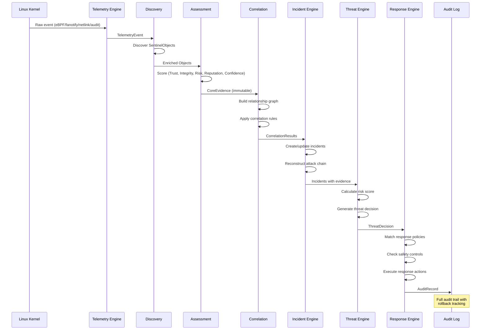

</details>

<br />

---

## 📂 Directory Structure

<details>
<summary><b>📁 Full Directory Tree — Click to expand</b></summary>

```
sentinelx/
├── Cargo.toml              # Workspace root (40 members)
├── Cargo.lock              # Dependency lockfile
├── VERSION                 # 1.0.0
├── LICENSE                 # GPL-3.0-or-later
├── README.md               # This file
├── CHANGELOG.md            # Version history
├── CONTRIBUTING.md         # Contribution guide
├── SECURITY.md             # Security policy
├── CODE_OF_CONDUCT.md      # Code of conduct
├── RELEASE_NOTES.md        # v1.0.0 release notes
├── KNOWN_LIMITATIONS.md    # Known limitations
├── ROADMAP.md              # Future roadmap
├── deny.toml               # cargo-deny config
├── Makefile                # Build automation
├── Dockerfile              # Multi-stage Docker build
├── docker-compose.yml      # Docker Compose config
│
├── crates/                 # 34 Rust library crates
│   ├── common/             # Shared types and traits
│   ├── config/             # Configuration management
│   ├── core/               # Pipeline coordinator
│   ├── database/           # SQLite storage
│   ├── telemetry/          # Telemetry engine
│   ├── assessment/         # Assessment engine
│   ├── detector/           # Detection engine
│   ├── evidence/           # Evidence store
│   ├── rule_engine/        # Custom rules
│   ├── process/            # Process scanning
│   ├── module/             # Module scanning
│   ├── network/            # Network scanning
│   ├── kernel/             # Kernel integrity
│   ├── memory/             # Memory integrity
│   ├── integrity/          # File integrity
│   ├── persistence/        # Persistence scanning
│   ├── forensics/          # Forensic snapshots
│   ├── ebpf/               # eBPF sensor
│   ├── fanotify/           # fanotify monitoring
│   ├── netlink/            # Netlink monitoring
│   ├── audit/              # Audit subsystem
│   ├── correlation/        # Correlation engine
│   ├── incident/           # Incident management
│   ├── threat/             # Threat decisions
│   ├── timeline/           # Attack timeline
│   ├── behavior/           # Behavior profiling
│   ├── intelligence/       # Threat intelligence
│   ├── response/           # Response engine
│   ├── transport/          # TLS transport
│   ├── agent/              # Fleet agent
│   ├── coordinator/        # Fleet coordinator
│   ├── fleet/              # Fleet management
│   ├── benchmarks/         # Criterion benchmarks
│   └── integration-tests/  # Reliability tests
│
├── apps/
│   ├── cli/                # Command-line interface
│   └── dashboard/          # React web dashboard
│
├── backend/                # Axum REST API server
├── docs/                   # Documentation (14 files)
│   ├── diagrams/           # Mermaid diagrams (10 files)
│   ├── ARCHITECTURE_OVERVIEW.md
│   ├── INSTALL.md
│   ├── DEPLOYMENT.md
│   ├── OPERATIONS.md
│   ├── SECURITY.md
│   ├── PERFORMANCE.md
│   └── BENCHMARKS.md
│
├── examples/               # Usage examples
│   ├── config/             # Sample configuration
│   ├── api/                # API usage scripts
│   ├── cli/                # CLI usage scripts
│   ├── docker/             # Docker examples
│   ├── fleet/              # Fleet deployment guide
│   └── response/           # Custom response workflows
│
├── fuzz/                   # Fuzz testing (6 targets)
├── book/                   # mdBook documentation site
├── packaging/              # Packaging files
│   ├── PKGBUILD            # Arch Linux
│   ├── sentinelx.spec      # RPM
│   ├── sentinelx.service   # systemd
│   ├── sentinelx.conf      # Default config (TOML)
│   ├── sentinelx.install   # Arch install script
│   ├── install.sh          # Universal installer
│   └── uninstall.sh        # Uninstaller
│
└── .github/
    ├── workflows/          # CI/CD (3 workflows)
    ├── ISSUE_TEMPLATE/     # Issue templates
    ├── PULL_REQUEST_TEMPLATE.md
    ├── CODEOWNERS
    ├── dependabot.yml
    └── FUNDING.yml
```

</details>

<br />

---

## 🛠️ Technology Stack

| Technology | Version | Purpose |
|-----------|---------|---------|
| **Rust** | 1.75+ | Primary language — memory safety, zero-cost abstractions |
| **Tokio** | 1.x | Async runtime — industry-standard async Rust |
| **Axum** | 0.7 | HTTP framework — Tower-based, ergonomic, production-ready |
| **SQLx** | 0.8 | Database — async SQLite with compile-time query checks |
| **Serde** | 1.x | Serialization — de facto standard for Rust |
| **Tracing** | 0.1 | Structured logging — distributed tracing, structured events |
| **Clap** | 4.x | CLI framework — derive-based, type-safe argument parsing |
| **Aya** | 0.14 | eBPF framework — pure-Rust eBPF, no C dependencies |
| **rustls** | 0.23 | TLS — memory-safe TLS, no OpenSSL dependency |
| **flate2** | 1.x | Compression — gzip compression for transport |
| **React** | 18.x | Dashboard UI — component-based SPA |
| **TypeScript** | 5.x | Dashboard types — type safety for frontend |
| **Vite** | 5.x | Dashboard build — fast HMR, optimized builds |
| **SQLite** | 3.x | Database — zero-config, embedded, reliable |
| **Docker** | - | Containerization — standard deployment format |

<details>
<summary><b>🦀 Why Rust Over C/C++? — Click to expand</b></summary>

| Criterion | C/C++ | Rust |
|-----------|-------|------|
| Memory safety | Manual management | Compiler-enforced |
| Data races | Possible at runtime | Prevented at compile time |
| Unsafe code | Implicit everywhere | Explicit and auditable |
| Dependencies | System package manager | Cargo with lockfile |
| Testing | Multiple frameworks | Built-in `cargo test` |
| Documentation | Varies | `cargo doc` with doc comments |

</details>

<br />

---

## 📦 Installation

### System Requirements

| Requirement | Minimum | Recommended |
|------------|---------|-------------|
| OS | Linux 5.8+ | Linux 6.1+ |
| Architecture | x86_64, aarch64 | x86_64 |
| RAM | 256 MB | 512 MB |
| Disk | 100 MB | 500 MB |
| Rust | 1.75+ | Latest stable |
| Privileges | root (for kernel access) | root |

<details>
<summary><b>📦 Arch Linux</b></summary>

```bash
# From AUR
yay -S sentinelx

# Or build from source
git clone https://github.com/0xhroot/sentinelx
cd sentinelx
makepkg -si
```

</details>

<details>
<summary><b>📦 Debian / Ubuntu</b></summary>

```bash
# Install dependencies
sudo apt install build-essential libssl-dev pkg-config

# Build from source
git clone https://github.com/0xhroot/sentinelx
cd sentinelx
cargo build --release

# Install
sudo cp target/release/sentinelx-backend /usr/bin/
sudo cp target/release/sentinelx-cli /usr/bin/
sudo cp packaging/sentinelx.service /etc/systemd/system/
sudo cp packaging/sentinelx.conf /etc/sentinelx/sentinelx.toml
```

</details>

<details>
<summary><b>📦 Fedora / RHEL</b></summary>

```bash
# Install dependencies
sudo dnf install gcc openssl-devel sqlite-devel

# Build from source
git clone https://github.com/0xhroot/sentinelx
cd sentinelx
cargo build --release

# Install
sudo cp target/release/sentinelx-backend /usr/bin/
sudo cp target/release/sentinelx-cli /usr/bin/
```

</details>

<details>
<summary><b>🐳 Docker</b></summary>

```bash
# Pull and run
docker pull ghcr.io/0xhroot/sentinelx:latest
docker run -d \
  --name sentinelx \
  --cap-add NET_ADMIN \
  --cap-add SYS_PTRACE \
  --cap-add AUDIT_CONTROL \
  --cap-add SYSLOG \
  -v sentinelx-data:/var/lib/sentinelx \
  -p 8443:8443 \
  ghcr.io/0xhroot/sentinelx:latest
```

</details>

<details>
<summary><b>🐳 Docker Compose</b></summary>

```yaml
version: "3.8"
services:
  sentinelx:
    build: .
    cap_add:
      - NET_ADMIN
      - SYS_PTRACE
      - AUDIT_CONTROL
      - SYSLOG
    volumes:
      - sentinelx-data:/var/lib/sentinelx
      - ./sentinelx.toml:/etc/sentinelx/sentinelx.toml:ro
    ports:
      - "8443:8443"
    restart: unless-stopped
volumes:
  sentinelx-data:
```

</details>

<details>
<summary><b>🔨 From Source</b></summary>

```bash
# Clone
git clone https://github.com/0xhroot/sentinelx
cd sentinelx

# Build (debug)
cargo build

# Build (release, optimized)
cargo build --release

# Run tests
cargo test --workspace

# Install
cargo install --path backend
cargo install --path apps/cli
```

</details>

<br />

---

## 🔧 Configuration

SentinelX uses TOML configuration. The default config is at `/etc/sentinelx/sentinelx.toml`.

<details>
<summary><b>📝 Complete Configuration Reference — Click to expand</b></summary>

```toml
[general]
hostname = ""                       # System hostname (auto-detected if empty)
scan_interval_seconds = 60          # Scan interval for continuous monitoring
baseline_on_start = true            # Capture baseline on first start
max_memory_mb = 150                 # Maximum memory usage in MB
max_cpu_percent = 3.0               # Maximum CPU usage percentage

[detection]
enabled_detectors = [
    "kernel_integrity",
    "hidden_process",
    "hidden_module",
    "hidden_connection",
    "hook_detection",
    "memory_integrity",
    "persistence",
    "privilege_escalation",
]
severity_threshold = "low"          # Minimum severity threshold for alerts
mitre_attack_mapping = true         # Enable MITRE ATT&CK mapping
evidence_collection = true          # Enable evidence collection

[monitoring]
process = true
network = true
module = true
memory = true
syscall = true
file_integrity = true

[storage]
database_path = "/var/lib/sentinelx/sentinelx.db"
evidence_path = "/var/lib/sentinelx/evidence"
log_path = "/var/log/sentinelx"
retention_days = 90
max_events = 1000000

[api]
enabled = true
host = "127.0.0.1"
port = 8443
tls_enabled = false
tls_cert_path = ""
tls_key_path = ""
cors_origins = []

[logging]
level = "info"                      # trace, debug, info, warn, error
format = "text"                     # text, json
file_output = ""
json_format = false

[ebpf]
enabled = true
map_size = 10240
perf_buffer_pages = 64
max_events_per_second = 10000
```

</details>

| Environment Variable | Default | Description |
|---------------------|---------|-------------|
| `RUST_LOG` | `info` | Tracing log filter |
| `SENTINELX_CONFIG` | `/etc/sentinelx/sentinelx.toml` | Configuration file path |

<br />

---

## 💻 CLI Reference

SentinelX provides **34 CLI commands** organized by category.

<details>
<summary><b>🔍 Detection Commands</b></summary>

| Command | Description | Example |
|---------|-------------|---------|
| `scan` | Run full detection scan | `sentinelx-cli scan` |
| `monitor` | Continuous monitoring mode | `sentinelx-cli monitor --interval 30` |
| `status` | System status and metrics | `sentinelx-cli status` |
| `integrity` | Kernel and file integrity | `sentinelx-cli integrity` |
| `modules` | Kernel modules with trust | `sentinelx-cli modules` |
| `processes` | Running processes | `sentinelx-cli processes` |
| `network` | Active connections | `sentinelx-cli network` |

</details>

<details>
<summary><b>📊 Analysis Commands</b></summary>

| Command | Description | Example |
|---------|-------------|---------|
| `timeline` | Threat event timeline | `sentinelx-cli timeline` |
| `assess` | Run assessment engine | `sentinelx-cli assess --object-type process` |
| `incidents` | Security incidents | `sentinelx-cli incidents` |
| `threats` | Threat decisions | `sentinelx-cli threats` |
| `graph` | Correlation graph | `sentinelx-cli graph` |

</details>

<details>
<summary><b>🔬 Forensics Commands</b></summary>

| Command | Description | Example |
|---------|-------------|---------|
| `forensics` | Forensic snapshot | `sentinelx-cli forensics` |
| `export` | Export to file | `sentinelx-cli export --format json --output ./export` |

</details>

<details>
<summary><b>🤖 Response Commands</b></summary>

| Command | Description | Example |
|---------|-------------|---------|
| `response` | Response engine status | `sentinelx-cli response` |
| `workflows` | Response workflows | `sentinelx-cli workflows` |
| `audit` | Response audit log | `sentinelx-cli audit` |

</details>

<details>
<summary><b>📡 Telemetry Commands</b></summary>

| Command | Description | Example |
|---------|-------------|---------|
| `telemetry` | Telemetry engine status | `sentinelx-cli telemetry` |
| `events` | Recent telemetry events | `sentinelx-cli events --count 50` |
| `providers` | Registered providers | `sentinelx-cli providers` |
| `monitor-live` | Live telemetry feed | `sentinelx-cli monitor-live --interval 5` |
| `ebpf` | eBPF sensor status | `sentinelx-cli ebpf` |
| `providers-health` | Provider diagnostics | `sentinelx-cli providers-health` |

</details>

<details>
<summary><b>🧠 Behavior Commands</b></summary>

| Command | Description | Example |
|---------|-------------|---------|
| `behavior` | Behavior engine status | `sentinelx-cli behavior` |
| `behavior-profiles` | Behavioral profiles | `sentinelx-cli behavior-profiles` |
| `behavior-stats` | Behavior statistics | `sentinelx-cli behavior-stats` |

</details>

<details>
<summary><b>🕵️ Intelligence Commands</b></summary>

| Command | Description | Example |
|---------|-------------|---------|
| `intel` | Intelligence engine status | `sentinelx-cli intel` |
| `mitre` | MITRE ATT&CK coverage | `sentinelx-cli mitre` |
| `iocs` | Loaded IoCs | `sentinelx-cli iocs` |
| `ioc-check` | Check IoC reputation | `sentinelx-cli ioc-check --type hash --value abc123` |
| `cves` | Tracked CVEs | `sentinelx-cli cves` |
| `yara` | YARA rules | `sentinelx-cli yara` |
| `sigma` | Sigma rules | `sentinelx-cli sigma` |

</details>

<details>
<summary><b>🚀 Fleet Commands</b></summary>

| Command | Description | Example |
|---------|-------------|---------|
| `fleet` | Fleet overview | `sentinelx-cli fleet` |
| `fleet-agents` | List agents | `sentinelx-cli fleet-agents` |
| `fleet-agent` | Agent detail | `sentinelx-cli fleet-agent --agent-id agent-001` |
| `fleet-policies` | Fleet policies | `sentinelx-cli fleet-policies` |
| `fleet-actions` | Remote actions | `sentinelx-cli fleet-actions` |

</details>

<details>
<summary><b>⚙️ Config Commands</b></summary>

| Command | Description | Example |
|---------|-------------|---------|
| `config` | Show configuration | `sentinelx-cli config` |

</details>

<br />

---

## 🔌 REST API

SentinelX exposes **86 REST API endpoints** organized by category.

**Base URL:** `http://localhost:8443/api`

<details>
<summary><b>🔗 Core Endpoints</b></summary>

| Method | Endpoint | Description |
|--------|----------|-------------|
| `GET` | `/api/health` | Health check |
| `GET` | `/api/status` | System status |
| `POST` | `/api/scan` | Run full scan |
| `POST` | `/api/scan/{detector}` | Run specific detector |
| `GET` | `/api/detectors` | List detectors |

</details>

<details>
<summary><b>⚠️ Threat Endpoints</b></summary>

| Method | Endpoint | Description |
|--------|----------|-------------|
| `GET` | `/api/threats` | List threats |
| `GET` | `/api/threats/stats` | Threat statistics |
| `GET` | `/api/threats/{id}` | Get threat |
| `POST` | `/api/threats/{id}/acknowledge` | Acknowledge threat |
| `POST` | `/api/threats/{id}/resolve` | Resolve threat |

</details>

<details>
<summary><b>🔍 Detection Endpoints</b></summary>

| Method | Endpoint | Description |
|--------|----------|-------------|
| `GET` | `/api/processes` | List processes |
| `GET` | `/api/modules` | List modules |
| `GET` | `/api/network` | List connections |
| `GET` | `/api/kernel/integrity` | Kernel integrity |
| `GET` | `/api/memory/integrity` | Memory integrity |

</details>

<details>
<summary><b>📋 Evidence Endpoints</b></summary>

| Method | Endpoint | Description |
|--------|----------|-------------|
| `GET` | `/api/evidence` | List evidence |
| `POST` | `/api/evidence/collect` | Collect evidence |
| `GET` | `/api/evidence/stats` | Evidence statistics |

</details>

<details>
<summary><b>🚨 Incident Endpoints</b></summary>

| Method | Endpoint | Description |
|--------|----------|-------------|
| `GET` | `/api/incidents` | List incidents |
| `GET` | `/api/incidents/{id}` | Get incident |
| `POST` | `/api/incidents/{id}/status` | Update status |

</details>

<details>
<summary><b>🤖 Response Endpoints</b></summary>

| Method | Endpoint | Description |
|--------|----------|-------------|
| `GET` | `/api/responses` | List responses |
| `GET` | `/api/responses/audit` | Response audit log |
| `GET` | `/api/workflows` | List workflows |

</details>

<details>
<summary><b>📡 Telemetry Endpoints</b></summary>

| Method | Endpoint | Description |
|--------|----------|-------------|
| `GET` | `/api/telemetry` | Telemetry events |
| `GET` | `/api/telemetry/live` | Live event stream |
| `GET` | `/api/telemetry/providers` | List providers |
| `GET` | `/api/telemetry/providers/health` | Provider health |
| `GET` | `/api/telemetry/stats` | Telemetry statistics |

</details>

<details>
<summary><b>🕵️ Intelligence Endpoints</b></summary>

| Method | Endpoint | Description |
|--------|----------|-------------|
| `GET` | `/api/intelligence/iocs` | List IoCs |
| `POST` | `/api/intelligence/iocs` | Add IoC |
| `GET` | `/api/intelligence/mitre` | MITRE techniques |
| `GET` | `/api/intelligence/yara` | YARA rules |
| `GET` | `/api/intelligence/sigma` | Sigma rules |
| `GET` | `/api/intelligence/cves` | CVE entries |

</details>

<details>
<summary><b>🚀 Fleet Endpoints</b></summary>

| Method | Endpoint | Description |
|--------|----------|-------------|
| `GET` | `/api/fleet` | Fleet overview |
| `GET` | `/api/fleet/agents` | List agents |
| `GET` | `/api/fleet/agents/{id}` | Agent detail |
| `POST` | `/api/fleet/heartbeat` | Agent heartbeat |
| `GET` | `/api/fleet/policies` | Fleet policies |
| `POST` | `/api/fleet/policies` | Distribute policy |
| `GET` | `/api/fleet/actions` | Remote actions |

</details>

<details>
<summary><b>💡 Example: curl</b></summary>

```bash
# Health check
curl http://localhost:8443/api/health

# Run a scan
curl -X POST http://localhost:8443/api/scan

# List threats
curl http://localhost:8443/api/threats

# Get threat statistics
curl http://localhost:8443/api/threats/stats

# List incidents
curl http://localhost:8443/api/incidents

# Get telemetry events
curl http://localhost:8443/api/telemetry?count=10

# Live telemetry stream (SSE)
curl -N http://localhost:8443/api/telemetry/live

# Add an IoC
curl -X POST http://localhost:8443/api/intelligence/iocs \
  -H "Content-Type: application/json" \
  -d '{"type": "hash", "value": "abc123", "source": "manual"}'

# Fleet overview
curl http://localhost:8443/api/fleet
```

</details>

<br />

---

## 📊 Dashboard

SentinelX includes a **React + TypeScript** web dashboard with 10 monitoring pages.

| Page | Description |
|------|-------------|
| **Overview** | System health, key metrics, recent alerts |
| **Threats** | Active threats with severity, confidence, MITRE mapping |
| **Incidents** | Security incidents with lifecycle tracking |
| **Evidence** | Collected evidence with assessment scores |
| **Telemetry** | Real-time telemetry event feed |
| **Processes** | Running processes with suspicious indicators |
| **Modules** | Kernel modules with trust assessment |
| **Network** | Active connections with anomaly detection |
| **Kernel Integrity** | Kernel memory and structure integrity |
| **Settings** | Configuration management |

```bash
cd apps/dashboard
npm install
npm run dev      # Development server (port 5173)
npm run build    # Production build to dist/
```

<br />

---

## 🚀 Fleet Management

<details>
<summary><b>🏢 Fleet Architecture — Click to expand</b></summary>

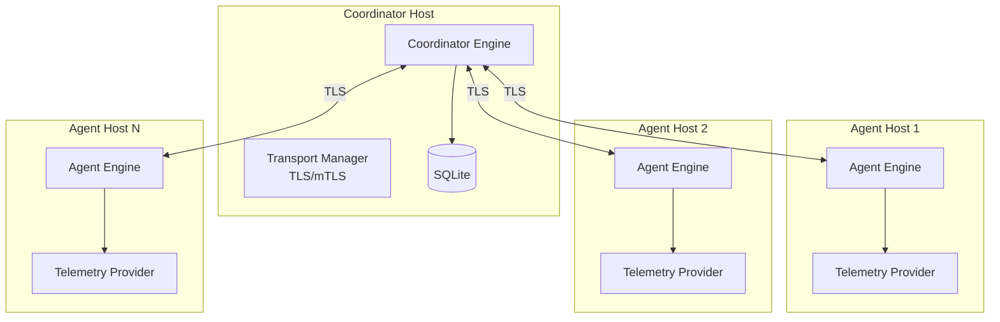

</details>

| Component | Role |
|-----------|------|
| **Coordinator** | Central coordination, policy distribution, action dispatch |
| **Agent** | Endpoint agent, telemetry collection, action execution |
| **Transport** | TLS/mTLS with gzip compression, message framing |
| **FleetManager** | High-level fleet operations, health tracking |

### Message Types

| Message | Direction | Purpose |
|---------|-----------|---------|
| `Registration` | Agent → Coordinator | Register new agent |
| `Heartbeat` | Agent → Coordinator | Periodic health check |
| `Telemetry` | Agent → Coordinator | Telemetry events |
| `Incident` | Agent → Coordinator | Security incidents |
| `Threat` | Agent → Coordinator | Threat decisions |
| `Policy` | Coordinator → Agent | Distribute policies |
| `RemoteAction` | Coordinator → Agent | Execute remote action |
| `RemoteActionResult` | Agent → Coordinator | Action result |

<br />

---

## 🔒 Security Model

<details>
<summary><b>🛡️ Trust Model & Least Privilege — Click to expand</b></summary>

### Trust Model

1. **Root privileges required**: Kernel-level monitoring requires root or specific capabilities
2. **Trusted bootloader**: The system bootloader and kernel are trusted
3. **Trusted SentinelX binary**: The SentinelX binary itself is not tampered with
4. **Trusted configuration**: The configuration file is not modified by an attacker

### Least Privilege

The systemd service uses minimal capabilities:

```
CapabilityBoundingSet=CAP_NET_ADMIN CAP_SYS_PTRACE CAP_AUDIT_CONTROL CAP_SYSLOG
```

| Capability | Purpose |
|-----------|---------|
| `CAP_NET_ADMIN` | Network monitoring, interface inspection |
| `CAP_SYS_PTRACE` | Process inspection, /proc access |
| `CAP_AUDIT_CONTROL` | Audit subsystem access |
| `CAP_SYSLOG` | Kernel log access |

</details>

<details>
<summary><b>⚠️ Response Safety Controls — Click to expand</b></summary>

| Safety Control | Description |
|---------------|-------------|
| Dry-run by default | All response actions are logged but not executed unless explicitly enabled |
| PID 1 protection | Never kills the init process |
| Core module protection | Never unloads vmlinux, core, nvidia, drm, or kvm modules |
| System binary protection | Never quarantines files in /usr/bin, /bin, /sbin |
| No file deletion | Files are quarantined, never deleted |
| Protected paths | /, /etc, /usr, /boot, /proc, /sys, /dev, /var/run, /run, /tmp |
| Audit logging | All actions are logged with full context |

</details>

<details>
<summary><b>🎯 Threat Model — Click to expand</b></summary>

| Threat | Mitigation |
|--------|-----------|
| Rootkit detection | eBPF-based kernel integrity monitoring |
| Hidden processes | Process enumeration comparison (procfs vs kernel) |
| Hidden modules | Module list comparison with load tracking |
| Hook detection | Syscall table, IDT, kernel function integrity |
| Memory tampering | Process memory integrity scanning |
| Persistence | Systemd, cron, rc.local, LD_PRELOAD monitoring |
| Privilege escalation | Capability change detection, setuid monitoring |
| Network exfiltration | Connection monitoring, hidden socket detection |

</details>

<br />

---

## ⚡ Performance

### Benchmark Results

| Benchmark | Median | p95 |
|-----------|--------|-----|
| Kernel integrity scan | ~50ms | ~80ms |
| Hook detection scan | ~30ms | ~50ms |
| Memory integrity scan | ~100ms | ~150ms |
| File integrity scan | ~200ms | ~300ms |
| Process scan | ~20ms | ~35ms |
| Network scan | ~15ms | ~25ms |
| Module trust scan | ~25ms | ~40ms |
| Full sequential scan | ~500ms | ~750ms |
| Full concurrent scan | ~200ms | ~350ms |
| Scan-to-timeline | ~600ms | ~900ms |
| Telemetry bus publish | ~1us | ~2us |
| Telemetry bus throughput | ~500K events/s | ~700K events/s |

### Resource Usage

| Resource | Idle | Active Scan | Continuous Monitoring |
|----------|------|-------------|----------------------|
| CPU | < 1% | < 3% | < 2% |
| Memory | ~30 MB | ~80 MB | ~50 MB |
| Disk I/O | Minimal | ~10 MB/s | ~1 MB/s |
| Network | None | None | None (unless fleet) |

> [!TIP]
> The release build uses maximum optimization: LTO, single codegen unit, opt-level 3, stripped symbols, abort on panic.

<br />

---

## 🧪 Testing

SentinelX has **696 tests** across all crates.

| Category | Count | Description |
|----------|-------|-------------|
| Unit tests | ~600 | Per-crate tests for individual functions |
| Integration tests | 10 | Reliability and failure mode tests |
| Doc tests | ~86 | Documentation examples |

```bash
# Run all tests
cargo test --workspace

# Run specific crate tests
cargo test -p sentinelx-telemetry

# Run with output
cargo test --workspace -- --nocapture
```

<details>
<summary><b>🧪 Integration Test Coverage — Click to expand</b></summary>

1. Database corruption handling
2. Network disconnection recovery
3. Agent state transitions
4. Telemetry engine restart
5. Panic recovery (task isolation)
6. Response dry-run execution
7. Concurrent stress testing
8. Channel backpressure
9. Configuration reload
10. Graceful shutdown

</details>

<details>
<summary><b>🔬 Fuzz Testing — Click to expand</b></summary>

Six fuzz targets in `fuzz/`:

| Target | Focus |
|--------|-------|
| `fuzz_telemetry_event` | Telemetry event parsing |
| `fuzz_api_request` | API request handling |
| `fuzz_rule_parser` | TOML rule parsing |
| `fuzz_database_query` | SQL query construction |
| `fuzz_message_transport` | Message deserialization |
| `fuzz_response_policy` | Policy evaluation |

</details>

<details>
<summary><b>🏎️ Benchmarks — Click to expand</b></summary>

```bash
# Run all benchmarks
cargo bench --workspace

# Run specific benchmark suite
cargo bench --bench detector_scan
cargo bench --bench full_scan
cargo bench --bench analysis_pipeline
cargo bench --bench telemetry_throughput
```

</details>

### CI Pipeline

> [!NOTE]
> Every push runs: formatting check, clippy linting, all 696 tests, release build, and security audit.

<br />

---

## 👨‍💻 Development Guide

<details>
<summary><b>🔧 Extension Points — Click to expand</b></summary>

| Task | Steps |
|------|-------|
| **New Detector** | Create crate implementing `DiscoveryProvider`, `MetadataCollector`, `ObjectAssessor` → register in `backend/src/main.rs` → add to workspace → write tests → add CLI commands |
| **New Assessment Dimension** | Add assessor in `crates/assessment/src/` → implement `ObjectAssessor` trait → register in `create_all_assessors()` → add config |
| **New Correlation Rule** | Define TOML rule → add to `DEFAULT_RULES` in `crates/correlation/src/lib.rs` → implement logic → write tests |
| **New Response Action** | Add variant to `ResponseAction` enum → implement in `engine.rs` → add safety checks → write tests |
| **New Telemetry Provider** | Implement `TelemetryProvider` trait → register in `TelemetryEngine::register_provider()` → add to `ProviderManager` → implement fallback |
| **New API Endpoint** | Add handler in `backend/src/routes.rs` → register in `router()` → add types → write tests |
| **New CLI Command** | Add variant to `Commands` enum → implement handler → add help text → write tests |

</details>

<br />

---

## 🔌 Plugin Architecture

SentinelX uses a trait-based extension model:

| Extension Point | Trait | Crate |
|----------------|-------|-------|
| Detection | `DiscoveryProvider`, `MetadataCollector`, `ObjectAssessor` | `core` |
| Assessment | `ObjectAssessor` | `assessment` |
| Correlation | `CorrelationRule` (TOML-driven) | `correlation` |
| Response | `ResponseAction` (enum-based) | `response` |
| Telemetry | `TelemetryProvider` | `telemetry` |
| Rules | `RuleCondition` (TOML-driven) | `rule_engine` |

> [!NOTE]
> **Future Plugin System (v2.0):** WASM-based plugin runtime, dynamic detection plugins, user-defined telemetry providers, custom response action plugins, API for external integrations.

<br />

---

## 🗺️ Roadmap

| Version | Highlights |
|---------|-----------|
| **v1.0.0** *(current)* | Evidence-driven pipeline, 7 detection engines, 4 telemetry providers, correlation & incident management, automated response with safety controls, fleet management, REST API (86 endpoints), CLI (34 commands), React dashboard |
| **v1.1.0** | PostgreSQL support, web-based management UI, automatic rule updates, enhanced MITRE ATT&CK coverage, performance improvements |
| **v1.2.0** | macOS support, Windows support (limited), container runtime monitoring, Kubernetes integration |
| **v1.3.0** | Machine learning detection, cloud deployment support, multi-tenant architecture, advanced behavioral analysis |
| **v2.0.0** | Plugin system (WASM), API v2 with gRPC, distributed telemetry, advanced threat hunting, integration marketplace |

<br />

---

## ⚖️ Comparison With Other Tools

| Feature | SentinelX | Falco | Wazuh | Velociraptor | Osquery |
|---------|-----------|-------|-------|--------------|---------|
| **Language** | Rust | C++ | C | Go | C++ |
| **Memory Safety** | Yes | Partial | No | Yes | No |
| **Kernel Monitoring** | eBPF + fanotify + netlink + audit | eBPF + syscall | Syscall audit | OS queries | OS queries |
| **Detection Method** | Evidence-driven pipeline | Rules | Rules + ML | Artifacts | Queries |
| **Response** | Built-in automated | Via sidekick | Built-in | Built-in | None |
| **Fleet Management** | Built-in | Via Falco sidekick | Built-in | Built-in | Via osqueryi |
| **Deployment** | Single binary + systemd | DaemonSet | Agent + manager | Single binary | Agent |
| **Configuration** | TOML | YAML | XML | YAML | SQL-like |
| **Database** | SQLite | None | MySQL/PostgreSQL | SQLite | None |
| **Dashboard** | Built-in React | Via Kibana | Built-in | None | None |
| **License** | GPL-3.0 | Apache-2.0 | GPL-2.0 | Apache-2.0 | Apache-2.0 |

> [!NOTE]
> This comparison focuses on architecture and deployment model. Each tool has specific strengths for different use cases. SentinelX differentiates through its evidence-driven pipeline, built-in response engine, and memory-safe implementation.

<br />

---

## 📸 Screenshots

| Screenshot | Description |
|-----------|-------------|
| 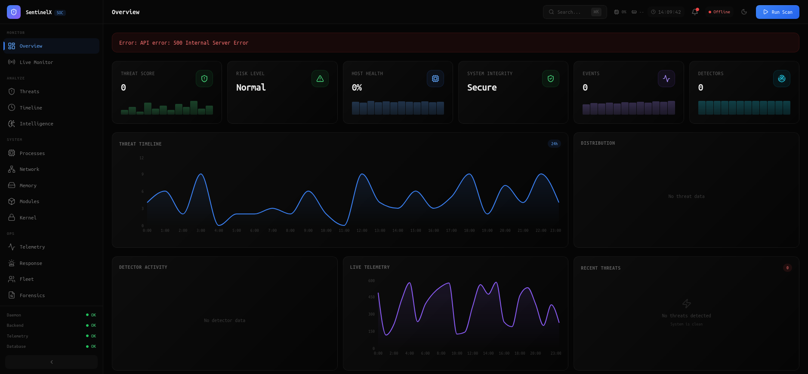 | **Dashboard Overview** — System health, key metrics, recent alerts |
| 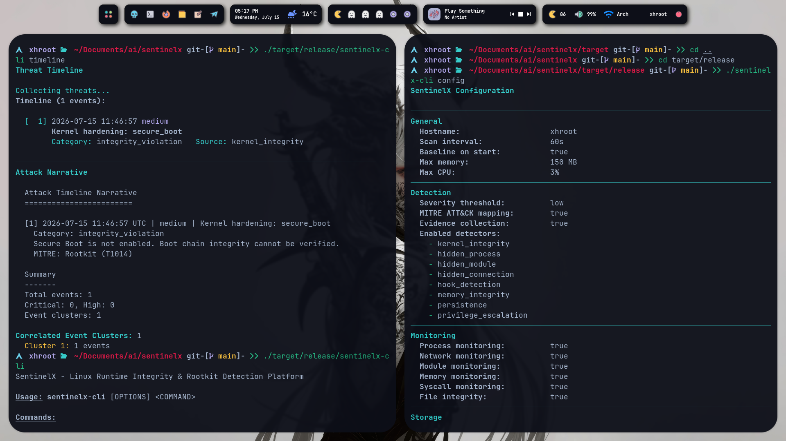 | **Threats View** — Active threats with severity and MITRE mapping |
|  | **Telemetry Feed** — Real-time kernel events |
| 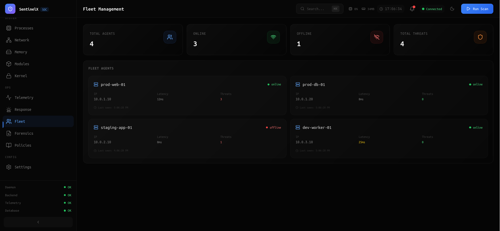 | **Fleet Management** — Multi-host agent status |
|  | **CLI Output** — Terminal-based detection results |
| 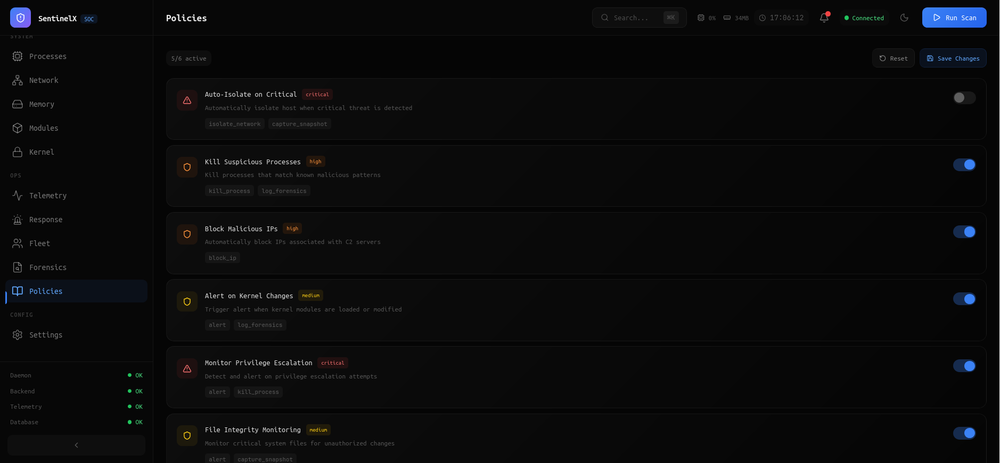 | **Response Policies** — Automated response configuration |

<br />

---

## ❓ Frequently Asked Questions

<details>
<summary><b>General</b></summary>

**Q: What is SentinelX?**
A: SentinelX is an open-source Linux runtime integrity monitoring and rootkit detection platform. It provides real-time kernel-level telemetry, multi-engine threat detection, automated incident response, and fleet management.

**Q: Why is it written in Rust?**
A: Rust provides memory safety without garbage collection, zero-cost abstractions for performance, and prevents data races at compile time. For a security tool that operates at the kernel level, these properties are critical.

**Q: Is SentinelX production-ready?**
A: SentinelX v1.0.0 is the first stable release. It has 696 tests, comprehensive documentation, and has been hardened through security auditing. It is suitable for production deployment with appropriate testing.

</details>

<details>
<summary><b>Installation</b></summary>

**Q: What Linux versions are supported?**
A: Linux kernel 5.8 or later is required for eBPF support. Tested on Ubuntu 20.04+, Debian 11+, Fedora 36+, Arch Linux, and RHEL 9+.

**Q: Can I run SentinelX without root?**
A: Root privileges are required for kernel-level monitoring (eBPF, fanotify, netlink, audit). Some features can run without root, but full detection capability requires root.

**Q: How much disk space does SentinelX need?**
A: The binary is approximately 10 MB. The database grows based on events; typical usage is 100-500 MB for 90-day retention.

</details>

<details>
<summary><b>Detection</b></summary>

**Q: What does SentinelX detect?**
A: Rootkits, hidden processes, hidden kernel modules, hook detection, memory tampering, file integrity violations, persistence mechanisms, privilege escalation, hidden network connections, and suspicious syscalls.

**Q: How does SentinelX differ from signature-based tools?**
A: SentinelX uses an evidence-driven pipeline that correlates multiple indicators over time, reducing false positives. It scores objects across five dimensions rather than matching signatures.

**Q: Does SentinelX support custom detection rules?**
A: Yes. The `rule_engine` crate supports TOML-defined rules with conditions (Equals, GreaterThan, Regex, And, Or).

</details>

<details>
<summary><b>Performance</b></summary>

**Q: What is the performance impact?**
A: Less than 3% CPU and 150 MB memory during active scanning. Idle usage is under 1% CPU and 30 MB memory.

**Q: Can SentinelX run continuously?**
A: Yes. Use `sentinelx-cli monitor --interval 30` for continuous monitoring. The telemetry engine runs in the background with configurable intervals.

</details>

<details>
<summary><b>Fleet</b></summary>

**Q: How does fleet management work?**
A: A central coordinator communicates with endpoint agents via TLS-encrypted connections. Agents send heartbeats, telemetry, and incidents. The coordinator distributes policies and remote actions.

**Q: Is fleet communication encrypted?**
A: Yes. All fleet communication uses rustls-based TLS with optional mutual TLS (mTLS) certificate verification.

</details>

<details>
<summary><b>Security</b></summary>

**Q: Is SentinelX itself secure?**
A: SentinelX is written in Rust with minimal unsafe code (52 FFI blocks, all audited). It uses parameterized SQL queries, input validation, and follows security best practices.

**Q: Can an attacker disable SentinelX?**
A: The systemd service uses `ProtectSystem=strict`, capability bounding, and system call filtering. An attacker would need root privileges to disable the service.

</details>

<details>
<summary><b>Development</b></summary>

**Q: How can I contribute?**
A: See [CONTRIBUTING.md](CONTRIBUTING.md) for guidelines. Areas for contribution include: new detection engines, additional MITRE ATT&CK techniques, documentation, tests, and packaging.

**Q: How do I add a new detection engine?**
A: Implement the `DiscoveryProvider`, `MetadataCollector`, and `ObjectAssessor` traits, then register the provider in `backend/src/main.rs`. See the [Development Guide](#-development-guide).

</details>

<br />

---

## 🤝 Contributing

We welcome contributions from the community. See [CONTRIBUTING.md](CONTRIBUTING.md) for detailed guidelines.

```bash
# Fork and clone
git clone https://github.com/your-username/sentinelx
cd sentinelx

# Create a branch
git checkout -b feature/my-feature

# Make changes and test
cargo test --workspace
cargo clippy --workspace --all-targets -- -D warnings
cargo fmt --all

# Commit and push
git commit -m "feat: add new detection engine"
git push origin feature/my-feature
```

**Areas for Contribution:**

| Area | Description |
|------|-------------|
| Detection | New detection engines, MITRE ATT&CK coverage |
| Documentation | Guides, examples, API docs |
| Testing | Unit tests, integration tests, fuzz targets |
| Packaging | Additional distributions |
| Dashboard | UI/UX improvements |
| Performance | Optimizations and benchmarks |
| Bug Fixes | Issues and regressions |

<br />

---

## 📄 License

SentinelX is licensed under the [GNU General Public License v3.0 or later](LICENSE).

You can:
- Use SentinelX for any purpose
- Study and modify the source code
- Distribute copies
- Distribute modified versions

Under the terms of the GPL-3.0, you must:
- Include the license and copyright notice
- State changes you made
- License your modifications under GPL-3.0
- Make source code available

For more information, see [https://www.gnu.org/licenses/gpl-3.0.html](https://www.gnu.org/licenses/gpl-3.0.html).

<br />

---

## 🙏 Acknowledgements

### Libraries

[Tokio](https://tokio.rs/) · [Axum](https://github.com/tokio-rs/axum) · [SQLx](https://github.com/launchbadge/sqlx) · [Serde](https://serde.rs/) · [Clap](https://github.com/clap-rs/clap) · [Aya](https://aya-rs.dev/) · [rustls](https://github.com/rustls/rustls) · [Tracing](https://github.com/tokio-rs/tracing) · [Chrono](https://github.com/chronotope/chrono) · [UUID](https://github.com/uuid-rs/uuid)

### Projects

[Falco](https://falco.org/) · [Wazuh](https://wazuh.com/) · [Velociraptor](https://docs.velociraptor.app/) · [Osquery](https://osquery.io/)

### Community

The Rust community for an incredible ecosystem · Linux kernel developers for eBPF, fanotify, and netlink · Open-source security researchers for threat detection methodologies · Contributors to the MITRE ATT&CK framework

<br />

---

<div align="center">

**[⬆ Back to Top](#sentinelx)**

---

<a href="https://github.com/0xhroot/sentinelx">
  
</a>
<!-- Fallback banner if SVG not available -->


**SentinelX v1.0.0** · [Documentation](docs/) · [API Reference](examples/api/openapi.yaml) · [Contributing](CONTRIBUTING.md) · [Security Policy](SECURITY.md)

*Built with Rust. Designed for Linux. Secured by evidence.*

<br />

<a href="https://github.com/0xhroot/sentinelx/stargazers">
  
</a>

</div>
